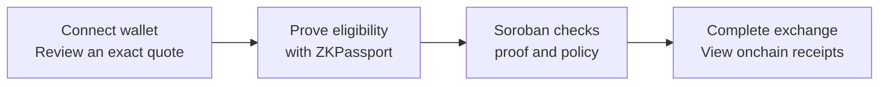
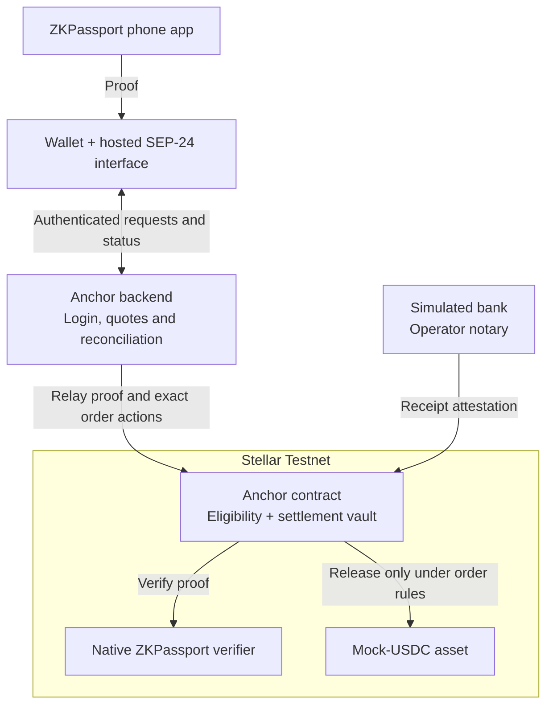

# Stellar Anchor + ZKPassport

**Privacy-preserving Pre-KYC for Stellar anchors.**

Check basic eligibility before asking users to complete the rest of onboarding.
An anchor connects bank money with blockchain tokens. Finding out late that an
applicant does not meet its requirements can mean unnecessary user effort,
document collection and verification work.

This project brings ZKPassport checks into an anchor's SEP-24 hosted flow.
Users generate a proof on their phone that they meet supported document
conditions, such as an age threshold or a nationality requirement. The anchor
verifies the proof on Stellar without collecting document details those checks
do not need. Any required full KYC and other checks remain separate.

The benefits for users and anchor teams:

- **Earlier eligibility decisions:** check supported requirements before
  additional onboarding steps. Reducing avoidable reviews and billable checks
  is a pilot goal, not a measured saving.
- **Less document disclosure:** check an age threshold without asking for a
  full date of birth. Share proof of the required condition.
- **Fewer repeat checks:** reuse accepted eligibility for the same wallet and
  policy while valid, for up to one hour, without another phone proof.
- **An anchor-hosted proof flow:** SEP-24 hosts the ZKPassport interaction, so
  the wallet does not need to generate ZK proofs itself.

We built the working example on
[Kaan's TR Mock Anchor](https://github.com/kaankacar/tr-mock-anchor), adding
SEP-24 onboarding, adapting an existing Soroban verifier for supported
ZKPassport proofs, and connecting eligibility to the settlement vault's rules.
The vault checks eligibility alongside each order's payment conditions before
releasing tokens. Each wallet payment remains separately authorized.

**Demonstrated on Testnet:** one fresh phone proof and two completed deposits,
including a second deposit that reused existing eligibility. Full KYC-provider
integration and measured cost or onboarding improvements remain pilot goals.

[Try the demo](https://anchor.trionlabs.dev/anchor) |
[See a verified proof](https://stellar.expert/explorer/testnet/tx/08c7c414b6782886f55443c7179a2077f069561e0f5690519d8e22403a1e816e) |
[Technical handoff](docs/ARCHITECTURE_AND_HANDOFF.md)

**Testnet only. Simulated TRY, self-issued mock USDC and synthetic documents.
No real money or identity documents.**

## The experience

- **Deposit:** simulate a TRY payment and receive mock USDC in your wallet.
- **Withdraw:** send an ordinary Stellar payment with a memo, then simulate
  TRY payout. Public end-to-end withdrawal testing is still pending.
- **Prove once, reuse while valid:** eligibility lasts up to one hour for
  the same wallet and policy. Every order still fixes its own amounts.

The synthetic demo checks age 18+, nationality ZKR and document issuer ZKR,
plus non-membership in a pinned sanctions snapshot. ZKR is a fictional test
country. A phone success message alone cannot authorize vault settlement.

## What we added

Kaan supplied the anchor foundation: discovery, wallet login, quotes,
deposit/withdrawal APIs and simulated banking. Our additions are:

1. **Native proof verification.** ZKPassport generates Noir-based proofs.
   Our adapted Rust/Soroban verifier checks the supported proof on Stellar,
   rather than trusting a backend "verified" flag.
2. **Contract-controlled settlement.** A separate vault enforces eligibility,
   exact order terms, bank receipts, payout authorization and recovery rules.
3. **Hosted private onboarding.** SEP-24 provides the QR flow, alongside
   the supported SEP-6 API and ordinary wallet payments.
4. **A usable demo.** Freighter setup, reusable eligibility, automatic status
   reconciliation and transaction-by-transaction explorer evidence.

## How it fits together

The proof is generated on the phone; the verifier and eligibility policy run
on Soroban. The backend coordinates the exchange but cannot replace the
vault's proof check with an approval flag.

For withdrawals, the wallet first pays the anchor's classic custody account.
Operators then fund the matching vault escrow. That intake step is trusted,
not trustless. [Full money flows and trust boundaries](docs/ARCHITECTURE_AND_HANDOFF.md#4-user-and-money-flows).

## What is proven

Evidence recorded on 20 September 2026:

| Milestone                                         | Status and evidence                                                                                                                                                                                     |
| ------------------------------------------------- | ------------------------------------------------------------------------------------------------------------------------------------------------------------------------------------------------------- |
| Fresh phone proof verified onchain                | [Confirmed native eligibility](https://stellar.expert/explorer/testnet/tx/08c7c414b6782886f55443c7179a2077f069561e0f5690519d8e22403a1e816e)                                                             |
| Public deposit                                    | [100 simulated TRY to 2.0947892 mock USDC](https://stellar.expert/explorer/testnet/tx/14d7463f6cf8b176ca3f9d6d2ccd10c51e2c4fc8ecd58472fce96d2f4c2553f1), with token events and balance increase checked |
| Second deposit using existing eligibility         | [Settlement confirmed](https://stellar.expert/explorer/testnet/tx/fd1b82745299a8955e225bb32ff8c6887f46973a4944f7a7b7557031b350daa4)                                                                     |
| Public withdrawal / other wallets' SEP interfaces | Implemented flows; end-to-end acceptance still pending                                                                                                                                                  |

At revision `f1347f4`, all **423 application tests** and both typechecks passed.
[CI also passed native and compiled-Wasm checks](https://github.com/0x471/tr-mock-anchor/actions/runs/35496032868).
Tests are evidence of tested behavior, not a security audit.

## Try the deposit demo

1. Open the [live app](https://anchor.trionlabs.dev/anchor).
   Use Freighter on **Stellar Testnet**. Ask the team to admit your public wallet
   first; never share a secret key.
2. Sign in, complete any prompted mock-USDC trustline setup, then review and
   accept a **100 simulated TRY** deposit quote.
3. If prompted, scan the QR using ZKPassport developer mode and the supported
   [adult synthetic ZKR document](docs/SYNTHETIC_DOCUMENT_SETUP.md). A current
   eligibility grant is reused automatically.
4. Wait for native eligibility, simulate the exact TRY receipt when prompted,
   and open the settlement link. Status updates automatically.

No real bank transfer is needed. If a response is lost, keep the same order
open; do not send a replacement payment. The immutable demo policy expires
**21 September 2026 at 01:54:22 Istanbul**.

## Deployed contracts

| Stellar Testnet component        | Contract ID                                                |
| -------------------------------- | ---------------------------------------------------------- |
| Eligibility and settlement vault | `CA4SZYDLN5Q2QUG6ZPVWCECSSFJPTRCQTL64VNTXOVTZNTVCCQIK2VRM` |
| Native Count8 verifier           | `CAXZT4KA4KDP4A2ERRMYEUBQE53XZ67NHXICO4AXNTAKJCXDKGFGCJ4H` |

[Asset issuer, Wasm hashes and complete deployment evidence](docs/SEP_ANCHOR_DEPLOYMENT.md).

## Honest limits

- Synthetic identity and bank flows only. The January 2026 sanctions snapshot
  is **not current sanctions clearance**; the separate backend OFAC address
  precheck is not full identity screening.
- Wallets, amounts, proof transactions and public inputs are public. Private
  document witnesses do not mean anonymous or unlinkable payments.
- The operator controls classic intake and simulated receipts. The vault does
  not constrain every transfer or issuance of this asset.
- Experimental and unaudited. Only admitted, self-custodial classic G accounts
  are supported; universal wallet interoperability is not claimed.

## Build on it

- [Architecture, code map and co-hacker setup](docs/ARCHITECTURE_AND_HANDOFF.md)
- [Post-hackathon roadmap](docs/ARCHITECTURE_AND_HANDOFF.md#proposed-post-hackathon-roadmap)
- [Review findings and remaining acceptance](docs/SEP_ANCHOR_REVIEW.md)
- [Contract implementation](contracts/sep-anchor/README.md) and [verifier details](contracts/zkpassport-verifier/README.md)
- [Historical prototypes and diagnostic instructions](docs/HISTORICAL_README.md)

Built on Kaan's anchor at `81eef8a`. We adapted Nethermind's Soroban verifier
for ZKPassport's pinned proof format; we did not create ZKPassport's circuits.
[Source attribution and licenses](contracts/zkpassport-verifier/NOTICE.md).
